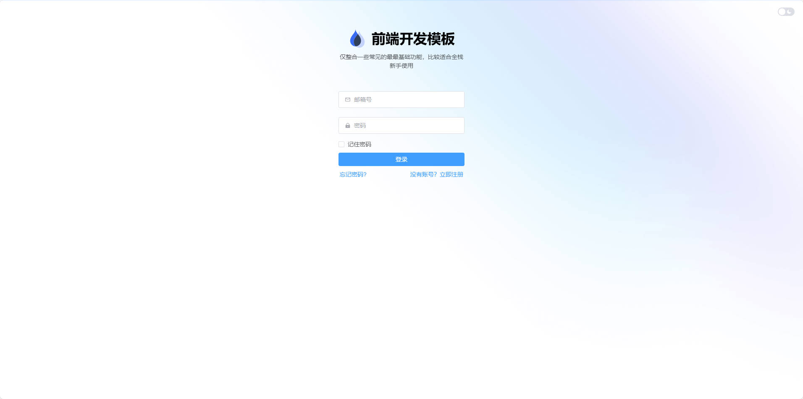
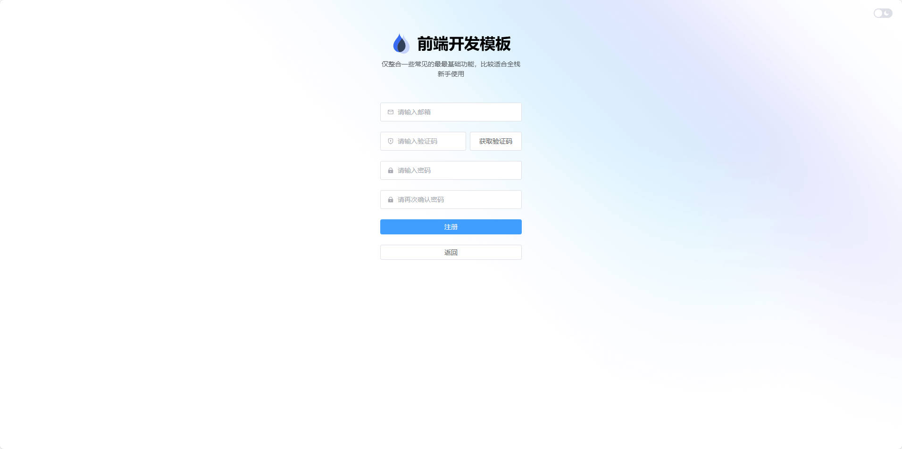
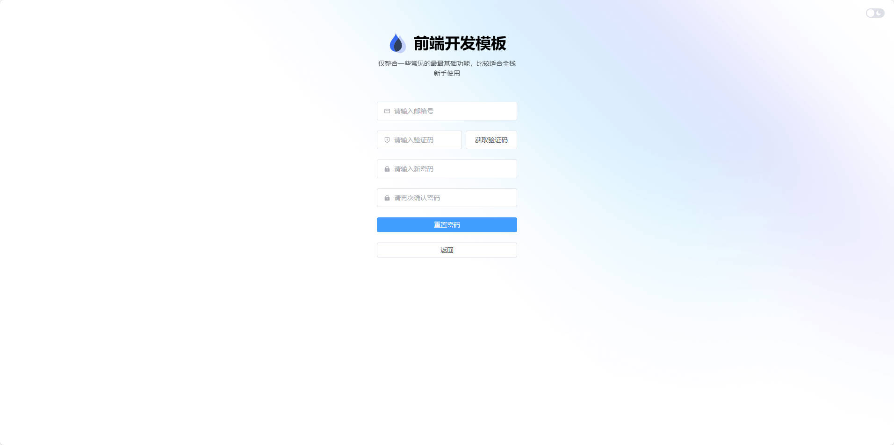
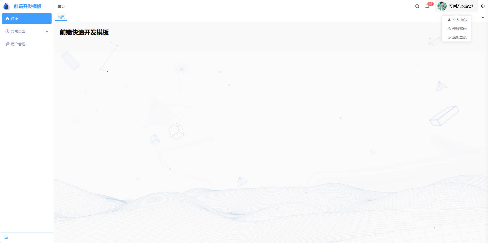
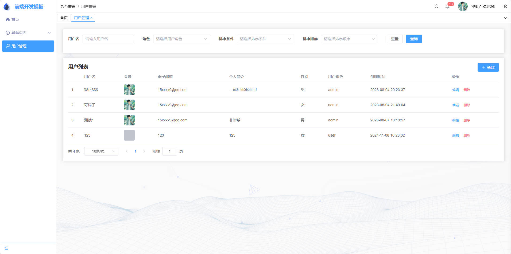
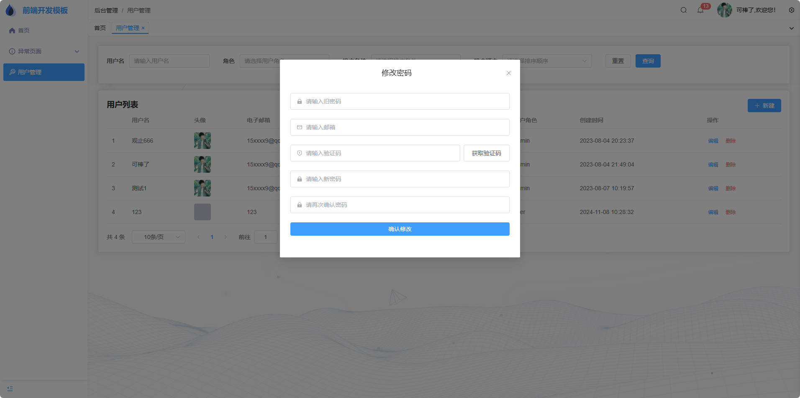
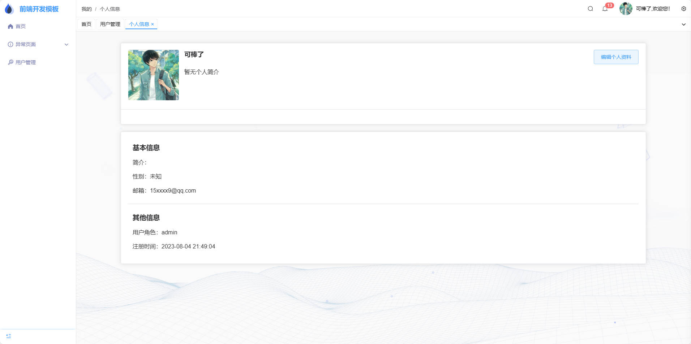
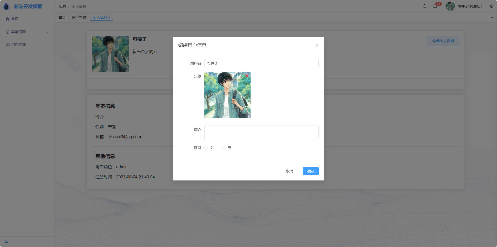

> 本项目是一个基于Vue3和SpringBoot的实时新闻推送系统，旨在为用户提供及时、准确的新闻资讯。系统采用前后端分离架构，包含新闻发布、新闻分类、用户订阅、实时推送等核心功能模块。项目基于[Vue3+SpringBoot项目快速开发模板](https://gitee.com/fspStudy/quick-develop-template)进行开发，持续更新中，欢迎贡献代码和提出改进建议！

# 一.功能预览

系统主要功能模块包括：

- 新闻发布与管理：支持富文本编辑、图片上传、新闻分类
- 实时新闻推送：基于WebSocket实现实时新闻推送
- 用户订阅管理：用户可订阅感兴趣的新闻分类
- 新闻搜索：支持按标题、内容、分类等多维度搜索
- 用户系统：包含登录注册、密码管理、个人信息维护
- 权限管理：不同角色（普通用户、编辑、管理员）拥有不同权限

## (1) 登录

登录、注册、修改密码、重置密码表单后端已实现基础的格式校验。



## (2) 注册

验证码方面都是采用邮箱验证码，参考博客：

- [邮箱验证码](https://blog.csdn.net/m0_66570338/article/details/128994951)



## (3) 重置密码


## (4) 主页



## (5) 用户管理

基础的增删改查功能，包括图片上传（admin角色状态展示）




## (6) 修改密码



## (7) 个人信息


## (8) 编辑个人信息



# 二.必备配置

项目运行所需配置项：

- 前端
  - 安装依赖：
  ```bash
  pnpm install
  ```
  - 开发环境启动：
  ```bash
  pnpm dev
  ```
  - 生产环境构建：
  ```bash
  pnpm build
  ```
  - 接口文档生成：
  ```bash
  pnpm openapi
  ```

- 后端
  - 数据库初始化：执行`/sql/create_table.sql`创建数据表
  - 配置文件修改：
    - `application.yml`：配置MySQL、Redis连接信息
    - `CodeUtils.java`：配置邮件服务信息
    - `OssConfig.java`：配置阿里云OSS存储信息
  - 项目启动：
  ```bash
  mvn spring-boot:run
  ```

# 三.代码仓库

- 项目地址：[https://github.com/your-repo/real-time-news-system.git](https://github.com/your-repo/real-time-news-system.git)
- 项目结构：
  - `frontend/`：Vue3前端项目
  - `backend/`：SpringBoot后端项目
  - `news-app/`：新闻前台的显示